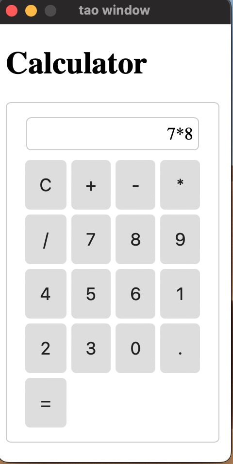

- 效果图
  - 

- 技术依赖
  - dioxus，它让制作各种终端的图形化程序变得简单，特别是对html元素+css的组合，因为这样的组合，不用花大量时间去学习不同端的页面元素，布局和响应。极大减轻开发负担。
  - WebAssembly，初步学习中，会尽快加入到此计算器的实现中
- 已实现
  - 无括号的整型混合运算
- TODO
  - 1, 解决`-7*8`这类问题
  - 2，解决`1.5*1.5`问题，即2个小数相乘
  - 3，进一步优化排版
  - 4, 增加括号和函数支持
  - 5，增加随意选择历史结果组合计算
  - 6，将计算过程及组合图形化，能更好，更方便计算，节约人脑记忆时间
    - 现在市面很多计算器都没有有效解决这个问题
  - 7，后续期望能形成一个组件，快速嵌入到各种终端中
